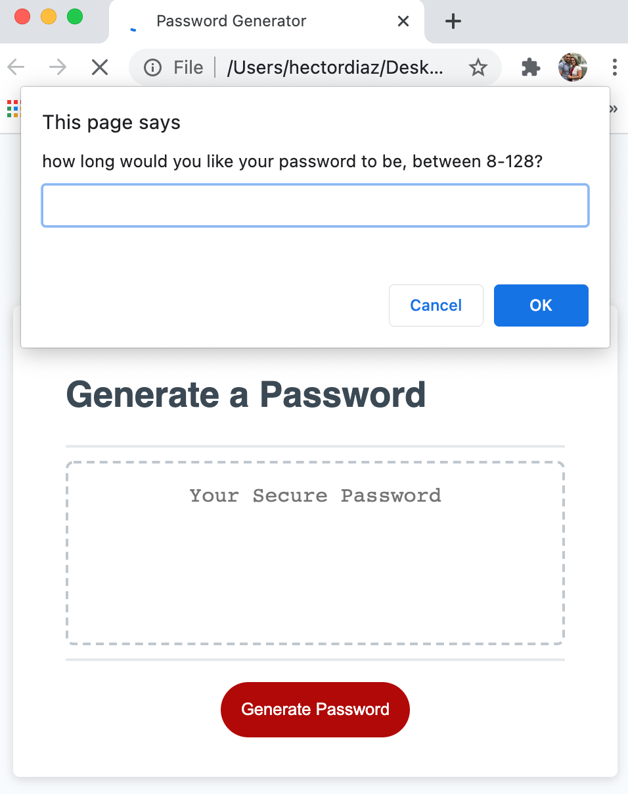

# Password-Generator
Creating a website to generate a secure password

This homework was about creating a password generator.

This one was quite difficult for me. I struggled to put the code together.

I started over 4 times on this project, before geting to a point where it functioned somewhat properly 

The idea was to ask the user a series of questions
1. how long would you like your password to be. The requirement was for the passord to be between 8-128.
needed to validate the number they selected to be sure it met the requierments
2. would you like an uppercase letter.
3. would you like a lowercase letter.
4. would you like a number.
5. would you like a symbol.
needed to be sure they selected at least one of these options 

next we had to generate the actual password.

this was the method

created a function to ask for the lenght, that function called itself if the lenght was not sufficient

created a function to confirm the upper,lower,number,symbol options. If none were choosen, the function called itslef. 

once the requirements were selected, all that were selected were placed into a string called userpw. 

from here i used math.random wrapped with math.floor to randomly pick a password from the userpw string. this was on a for loop based on the lenght of the password selected by the user.

the result went into another sting called password. this is the string that would eventually generate the password

below is an image of the deployed webpage 

below is a link to the repository
https://github.com/HectorDiazJr/Password-Generator

below is a link to the actual password generator 
https://hectordiazjr.github.io/Password-Generator/
